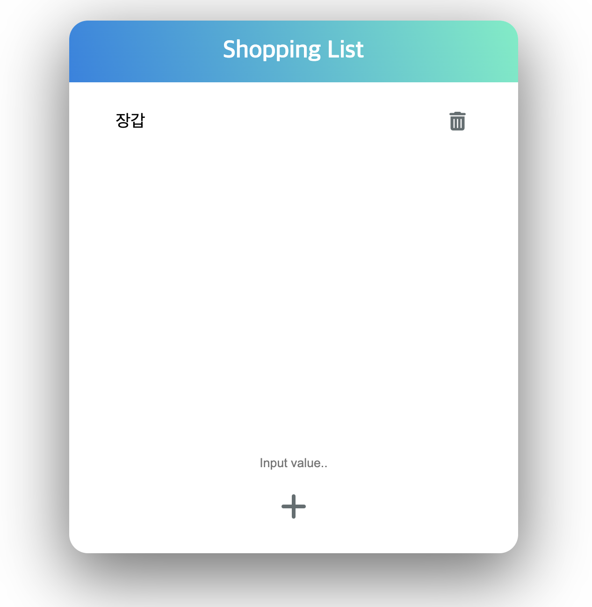
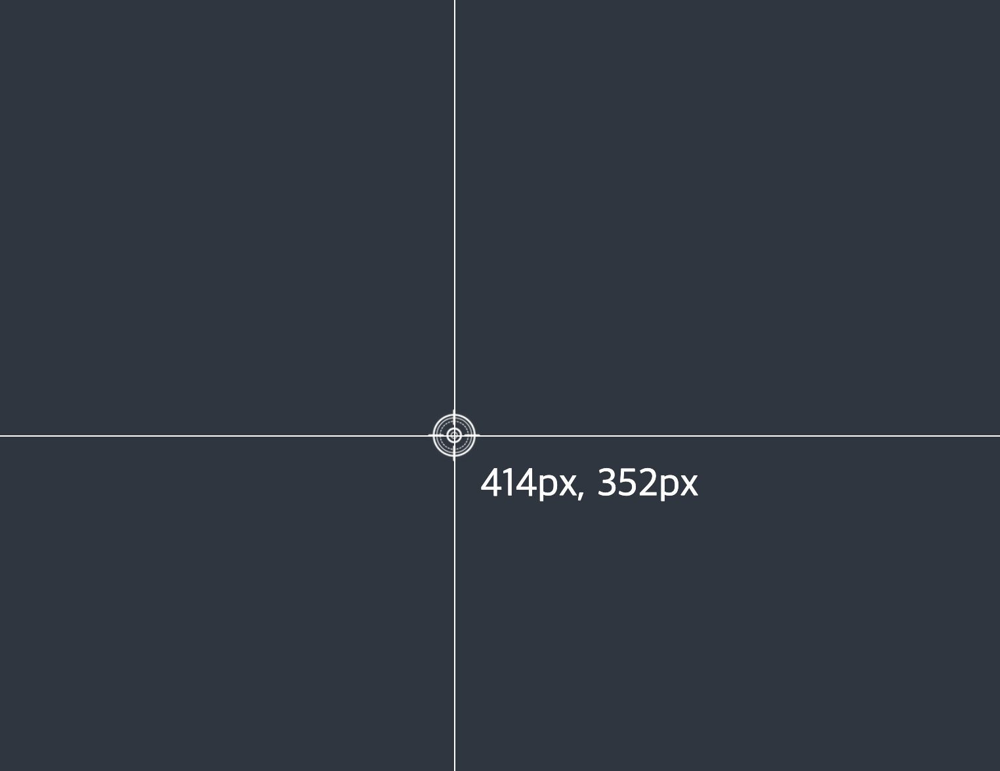
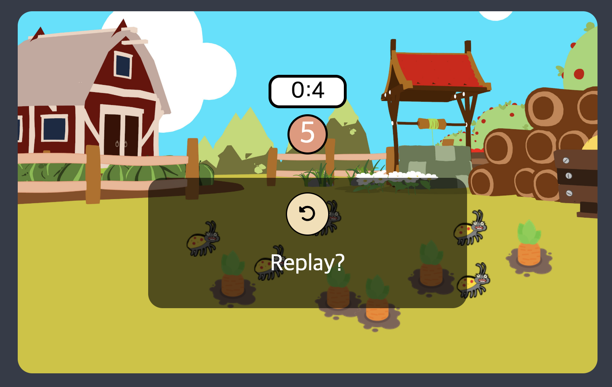

# JS & TS 학습하기

- 기간 : `23.03.02` ~

## 🚀 목적

- JS의 자료구조, 알고리즘, 브라우저, 인터페이스 등 공부해보면서 적어보자.

- JS로 간단한 것을 만들어보고, 실험하자.

- 다양한 라이브러리와 프레임워크를 사용해봤지만 JS로 직접 구현해보고 싶었고, 기초가 부족.

누구나 기술은 익힐 수 있다고 생각하지만 작동원리나 구현원리를 이해하는 것은 더 어렵다고 생각한다. 그래서 이를 위한 공부를 하고자 한다.

> 학습을 하는 궁극적인 목적은 `프로젝트`를 완성하는 것

 

---

## 🎯 학습내용

|   파일 이름    |              내용              |
| :------------: | :----------------------------: |
|   algorithm    |         알고리즘 구현          |
|    browser     | 브라우저, 이벤트 알고리즘 구현 |
|      core      |       부족했던 문법 학습       |
| data-structure |         자료구조 구현          |
| design-pattern |        디자인 패턴 학습        |
|      jest      |        테스트 코드 학습        |
|   typescript   |       타입스크립트 학습        |

- JS로 React, SPA 구현
- 리팩토링 학습
- JS 도구들 사용

 

---

## 📌 프로젝트

| 프로젝트 이름  |    핵심 기능     |              링크              |                                  사진                                  |
| :------------: | :--------------: | :----------------------------: | :--------------------------------------------------------------------: |
|    쇼핑목록    |  `이벤트 위임`   |   [dom](./brower/dom/실습/)    |  |
|    좌표찾기    | `좌표(Web APIs)` |  [webAPIs](./brower/webAPIs/)  |        |
| 당근 찾기 게임 |     `Event`      | [event](./brower/event/실습2/) |             |
