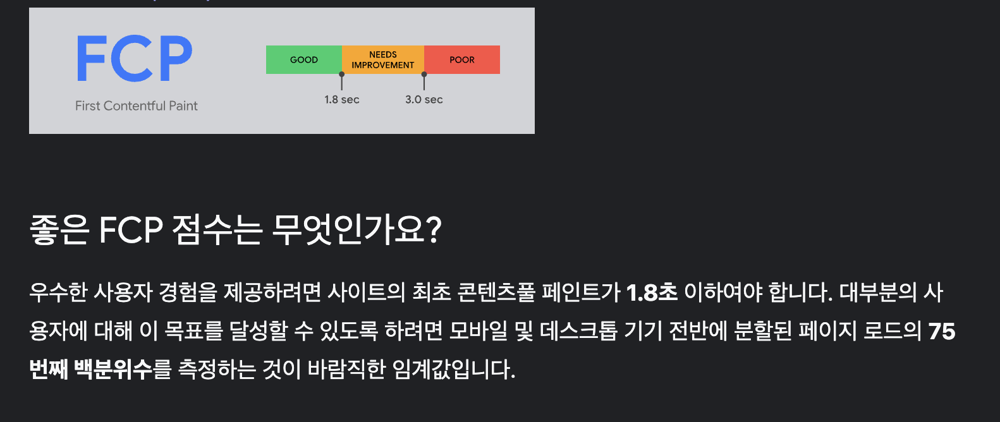
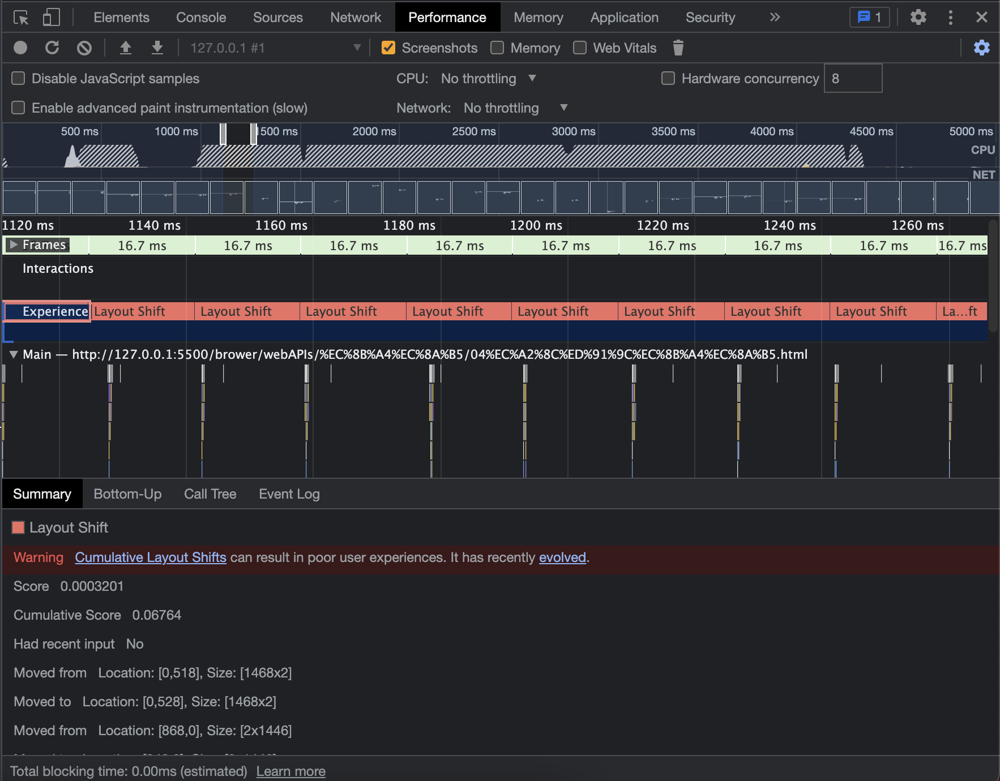
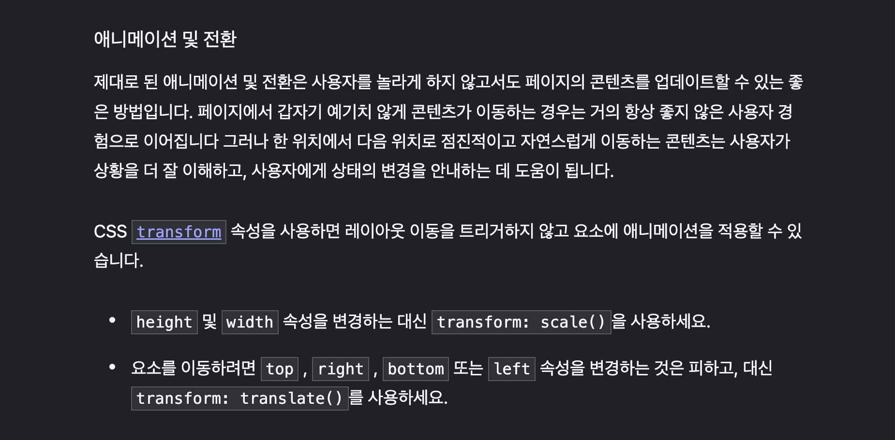
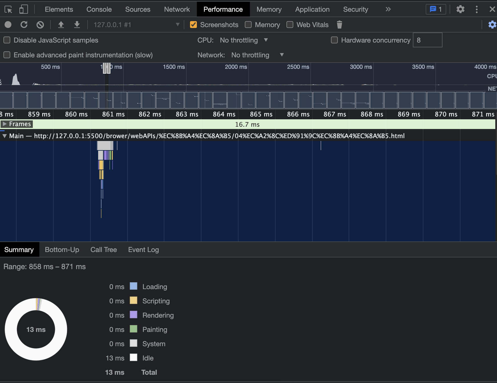

## 성능 개선

구글 크롬 개발자 도구 performance 탭을 이용하여 성능 개선을 해보자.

일반적인 지침에서는

- 웹 페이지의 성능은 사용자 경험에 큰 영향을 미치므로, 페이지 로드 시간을 줄이는 것이 중요합니다.

- 일반적으로 1 프레임당 16ms 미만으로 처리되는 것이 좋은 성능을 나타냅니다.

 

### 성능 측정

**문제점이 무엇일까?**

- `layout shift`가 발생하고 있다.

뒤늦게 로드가 되는 소스로 인하여 화면에서 봤을 때 밀리는 현상을 의미한다.

- top, left가 레이아웃 변경을 유발한다.

 

### 어떻게 해결할까?

참고 : https://web.dev/cls/?utm_source=devtools

 

### 해결

transform으로 바꾸면서 layout을 바꾸는 것이 아니라 composite만 바꾸어서 성능을 개선할 수 있다.
