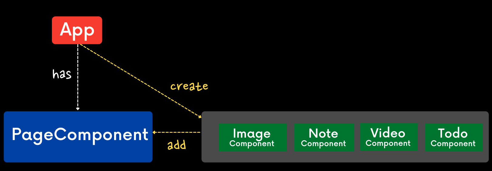

# Motion

## 📌 계획

### 1. 어떤 기능들이 있는지 정의

- 추상적이지 않고 정확하게 나열
- 여러가지 단계별 마일스톤을 설정

### 2. 페르소나 설정

- 사용자는 누구인가?
- 어떤 기능을 사용할 것인가?
- 의도는 무엇인가?

#### Mush have

- 이미지 등록 기능
- 비디오 등록 기능
- 노트 등록 기능
- 할일 등록 기능
- 삭제 기능

#### Good to have

- 드로그앤 드롭 기능

#### Nice to have

- 추가된 기능을 변경할 수 있는 기능

---

## 🚀 기능 요구 사항

- [ ] 클래스를 사용한다.

#### 초기세팅 기능

- [x] index.html 연결한다.
- [x] reset style 적용한다.
- [x] TS → JS 설정한다. (`dist` 폴더에 컴파일)
- [x] 프로그램 실행의 시작점은 `app.ts`에서 프로그램을 실행시킬 수 있어야 한다.

### 1. UI 구현

- [x] Header, document, footer 구조로 구성한다.
- [x] Header에는 타이틀, 버튼 (이미지 , 비디오, 노트, 할일 등록버튼)
- [x] 레이아웃 스타일링 한다.

> document는 section 단위로 동적으로 생성한다.

### 2. 컴포넌트 구현 기능

- [x] page 컴포넌트를 생성한다. `HTMLElement`를 생성하고 필요한 API를 구현한다.
- [x] app 클래스에 연결한다.
- [x] Item을 담는 page 컨테이너 컴포넌트를 생성한다.

#### page 컴포넌트 구현 기능

- [x] 공통 컴포넌트를 생성한다.
  - [x] element 멤버필드
  - [x] 생성하는 멤버함수
  - [x] 제거하는 멤버함수
- [x] 여러가지 아이템을 담을 수 있는 아이템 컴포넌트를 생성한다.

#### 각 Item 컴포넌트 구현 기능

- [x] image 컴포넌트를 생성한다.
- [x] note 컴포넌트를 생성한다.
- [x] todo 컴포넌트를 생성한다.
- [x] video 컴포넌트를 생성한다.
  - [x] 유튜브 url 생성 함수를 구현한다.

### 3. 컨트롤 패널 기능

- [x] 공통적인 Input 다이어로그창을 생성한다.
- [x] 미디어 등록하는 클래스 생성한다.
- [x] 텍스트 등록하는 클래스 생성한다.
- [x] 이미지 등록 연결한다.
- [x] 비디오 등록 연결한다.
- [x] 노트 등록 연결한다.
- [x] 할일 등록 연결한다.

##### 추가 기능

- [ ] 드로그앤 드롭 기능 구현한다.

---

## ✅ 정리

- `App`: 어플리케이션 전체를 가지고 있는 제일 큰 컨테이너 클래스
- `PageComponent`: 사용자가 추가하는 문서를 담을수 있는 페이지 컨테이너 컴포넌트 클래스
- `ImageComponent`: 사용자가 추가할 수 있는 문서중 하나의 타입으로, 이미지 노트

 

> 컴포넌트라면 기본적으로 가지고 있을수 있는 속성과 행동들이 중복적으로 담겨져 있다.

1.  문자열 태그로 부터 HTMLElement를 동적으로 생성함 element

2.  자기 자신을 다른 부모 컨테이너에추가 할 수 있는 attachTo

이 중복되는 속성과 행동들을 컴포넌트의 공통적인 클래스 `BaseComponent`

 

##### 왜 PageItemCoponent가 필요할까?

- 각각의 컴포넌트들 안에 boolean과 같은 것을 인자로 전달해서 if-else와 같은 번잡한 로직을 통해서 어떨때는 닫힘 버튼을 보여주고 어떨떄는 보여주지 않고를 작성해야함
- 그래서 실제의 보여지는 컨텐츠와 (Note, Image, Video. Todo..) 그리고 그것을 감싸서 꾸며주는 (닫힘 버튼이 추가된) `PageItemComponent` 같은 클래스를 만듬

##### Composable 인터페이스는 왜 필요해요?

- 커플링 (coupling)을 낮추기 위해서
  클래스들 간에 서로 지나치게 밀접하게 연관되어져 있으면 (커플링이 심하게 되어 있으면) 유지보수성, 확정성이 떨어진다

##### 인터페이스로 정의해서 클래스간에 인터페이스를 통해서 대화하는 것

- 나중에 클래스 관계가 복잡해질때, 서로간의 자세한 사항을, 클래스간에 서로의 이름을 알고 있는것은 커플링이다
- 클래스들 간에 서로 지나치게 밀접하게 연관되어져 있으면 (커플링이 심하게 되어 있으면) 유지보수성, 확정성이 떨어진다
- 그래서 이렇게 클래스에서 주된 규격 사항들을 인터페이스로 정의해 놓고, 클래스에서 그 인터페이스의 규격을 따라 가도록 구현해 놓고,
  사용하는곳에서 (다른 클래스 안에서 이 클래스를 사용하거나, 인자로 전달하거나 등등) 클래스 이름의 타입이 아니라,
  인터페이스 이름의 타입으로 지정해 두면! 다음에 다른 구현사항이 생기면 쉽게 다른 클래스로 변환이 가능.

```mermaid
classDiagram
  class Component {
    <<interface>>
    + attachTo(parent: HTMLElement, position?: InsertPosition): void
    + removeFrom(parent: HTMLElement): void
  }

  class App {
    - page: Component & Composable
    + constructor(appRoot: HTMLElement)
  }

  class BaseComponent {
    - element: T
    + constructor(htmlString: string)
    + attachTo(parent: HTMLElement, position?: InsertPosition): void
  }

  class Composable {
    <<interface>>
    + addChild(child: Component): void
  }

  class PageComponent {
    - pageItemConstructor: SectionContainerConstructor
    + constructor()
    + addChild(section: Component): void
  }

  class PageItemComponent {
    - closeListener?: OnCloseListener;
    + constructor()
    + addChild(child: Component): void
    + setOnCloseListener(listener: OnCloseListener): void
  }

  class ImageComponent {
    - title: string
    - url: string
    + constructor(title: string, url: string)
  }

  class NoteComponent {
    - title: string
    - body: string
    + constructor(title: string, body: string)
  }

  class TodoComponent {
    - title: string
    - body: string
    + constructor(title: string, body: string)
  }

  class VideoComponent {
    - title: string
    - url: string
    + constructor(title: string, url: string)
    + convertToEmbeddedURL(url: string): string
  }

  class SectionContainer {
    <<interface>>
    + setOnCloseListener(listener: OnCloseListener): void
  }

  class InputDialog {
    - closeListener?: OnCloseListener;
    - sumbitListener?: OnSubmitListener;
    + setOnCloseListener(listener: OnCloseListener): void
    + setOnSubmitListener(listener: OnSubmitListener): void
    + addChild(child: Component): void
  }

  class MediaData {
    <<interface>>
    - title: string
    - url: string
  }

  class TextData {
    <<interface>>
    - title: string
    - body: string
  }

  class TextSectionInput {
    + get title(): string
    + get body(): string
  }

  class MediaSectionInput {
    + get title(): string
    + get url(): string
  }

  Component <|.. BaseComponent
  Component <|-- SectionContainer

  BaseComponent <|-- InputDialog
  BaseComponent <|-- PageComponent
  BaseComponent <|-- PageItemComponent
  BaseComponent <|-- ImageComponent
  BaseComponent <|-- NoteComponent
  BaseComponent <|-- TodoComponent
  BaseComponent <|-- VideoComponent
  BaseComponent <|-- MediaSectionInput
  BaseComponent <|-- TextSectionInput

  Composable <|.. InputDialog
  Composable <|-- SectionContainer
  Composable <|.. PageComponent

  SectionContainer <|.. PageItemComponent

  MediaData <|.. MediaSectionInput
  TextData <|.. TextSectionInput

```

 

 

실무에서 객체지향에 대한 피드백

아직 배우는 단계이시라면, 이 다이어그램이 있다고 바로 다른 프로젝트를 처음부터 객체들간의 설계를 해놓고 바로 프로그래밍 하기에는 무리가 있다고 생각해요.

객체지향이란, 문제를 바라볼때, 기능을 바라볼때 관련된 로직들끼리 묶어서 객체들로 바라보고 생각하는 연습이 필요하기 때문이예요 :)

우리가 세상을 바라보면, 학생, 근로자, 그리고 회사, 근로자는 일을 하고, 회사는 근로자에게 월급을 지불하고, 이렇게 객체들 단위로 서로 유기적으로 이루어 지는것처럼요.

그래서 많은 연습이 필요하답니다.

프론트엔드는 정말 정적이거나 간단한 버전이 아니라면, 규모 있는 프로젝트에서는

많은 것을 간편하게 해결 할 수 있는 프레임워크/라이브러리 (리액트, 뷰, 앵귤러 등) 을 쓰는데, 그들의 성격에 따라 객체지향으로 작성해야 하는 경우가 있어요. (특히! 앵귤러가 첫번째고, 리액트와 뷰도 그랬지만, 조금씩 함수 단위로 옮겨가고는 있죠)

개발자라면 절차형, 객체지향, 함수형, 반응형 등 다양한 프로그래밍 방식에 대해서 알고 있고 그 차이점을 잘 이해하는것이 좋다고 생각해요. 제가 함께 일하는, 제 주변의 프론트엔드 개발자들은 객체지향을 모르는 분들이 거의 (거의 제로) 없어요.

지금 당장 필요하거나, 쓰이지 않을지라도, 객체지향은 필수 소양? 개념이니 이번에 수업을 듣고, 한번 OOP를 이용해서 프로젝트 하면서 단단하게 만드시면 좋을 것 같아요.

어디에서 삭제 기능을 구현해야할까?

PageItemComponent는 전체적인 페이지가 아니라, 페이지 안에 있는 아이템(노트) 하나만을 대표하는 친구예요.

물론 UI상으로 자기 자신을 직접 제거 할 수도 있지만,

페이지 (노트들을 가지고 있는 부모) 단에서 모든 아이템에 대해서 어떤 특정한 처리를 해줘야 해서 데이터를 가지고 있다면, 부모에게도 자신이 삭제 될 거라는걸 꼭 알려줘야 해요 :)

그래서 데이터는 직접 자신이 삭제하기 보다는, 전체적으로 관리 하고 있는 대상에서 위임하는것이 더 안전한 코딩 방법이랍니다.

