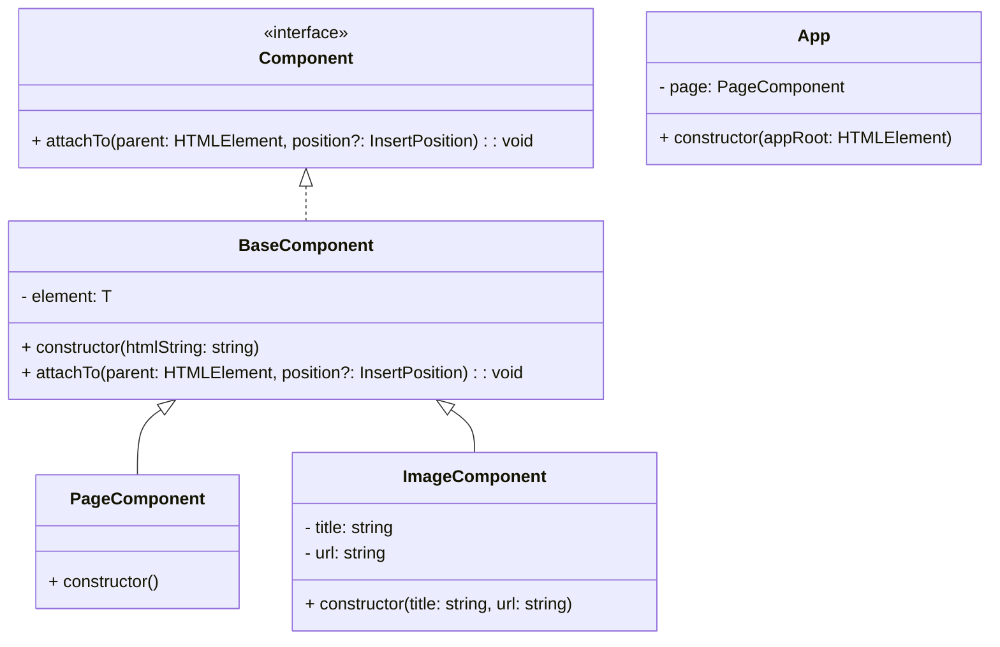

# Motion

## 📌 계획

### 1. 어떤 기능들이 있는지 정의

- 추상적이지 않고 정확하게 나열
- 여러가지 단계별 마일스톤을 설정

### 2. 페르소나 설정

- 사용자는 누구인가?
- 어떤 기능을 사용할 것인가?
- 의도는 무엇인가?

#### Mush have

- 이미지 등록 기능
- 비디오 등록 기능
- 노트 등록 기능
- 할일 등록 기능
- 삭제 기능

#### Good to have

- 드로그앤 드롭 기능

#### Nice to have

- 추가된 기능을 변경할 수 있는 기능

---

## 🚀 기능 요구 사항

- [ ] 클래스를 사용한다.

#### 초기세팅 기능

- [x] index.html 연결한다.
- [x] reset style 적용한다.
- [x] TS → JS 설정한다. (`dist` 폴더에 컴파일)
- [x] 프로그램 실행의 시작점은 `app.ts`에서 프로그램을 실행시킬 수 있어야 한다.

### 1. UI 구현

- [x] Header, document, footer 구조로 구성한다.
- [x] Header에는 타이틀, 버튼 (이미지 , 비디오, 노트, 할일 등록버튼)
- [x] 레이아웃 스타일링 한다.

> document는 section 단위로 동적으로 생성한다.

### 2. 컴포넌트 구현 기능

- [x] page 컴포넌트를 생성한다. `HTMLElement`를 생성하고 필요한 API를 구현한다.
- [x] app 클래스에 연결한다.

#### page 컴포넌트 안의 Item 컴포넌트 구현 기능

- [x] 공통 컴포넌트를 생성한다.

  - [x] element 멤버필드
  - [x] attachTo 멤버함수

- [x] image 컴포넌트를 생성한다.
- [x] note 컴포넌트를 생성한다.
- [x] todo 컴포넌트를 생성한다.
- [x] video 컴포넌트를 생성한다.
  - [x] 유튜브 url 생성 함수를 구현한다.

### 3. 컨트롤 패널 기능

##### 이미지 등록 기능

- [ ] 버튼 클릭 시, 타이틀, URL을 등록하는 모달창 생성한다.
- [ ] 등록 버튼 클릭 시, document에 이미지 등록한다.

##### 비디오 등록 기능

- [ ] 버튼 클릭 시, 타이틀, URL을 등록하는 모달창 생성한다.
- [ ] 등록 버튼 클릭 시, document에 이미지 등록한다.

##### 노트 등록 기능

- [ ] 버튼 클릭 시, 타이틀, 바디를 등록하는 모달창 생성한다.
- [ ] 등록 버튼 클릭 시, document에 이미지 등록한다.

##### 할일 등록 기능

- [ ] 버튼 클릭 시, 타이틀, 바디를 등록하는 모달창 생성한다.
- [ ] 등록 버튼 클릭 시, document에 이미지 등록한다.

##### 추가 기능

- [ ] 드로그앤 드롭 기능 구현한다.
- [ ] 삭제 기능 구현한다.

---

## ✅ 정리

- `App`: 어플리케이션 전체를 가지고 있는 제일 큰 컨테이너 클래스
- `PageComponent`: 사용자가 추가하는 문서를 담을수 있는 페이지 컨테이너 컴포넌트 클래스
- `ImageComponent`: 사용자가 추가할 수 있는 문서중 하나의 타입으로, 이미지 노트

 

> 컴포넌트라면 기본적으로 가지고 있을수 있는 속성과 행동들이 중복적으로 담겨져 있다.

1.  문자열 태그로 부터 HTMLElement를 동적으로 생성함 element

2.  자기 자신을 다른 부모 컨테이너에추가 할 수 있는 attachTo

이 중복되는 속성과 행동들을 컴포넌트의 공통적인 클래스 `BaseComponent`

 

